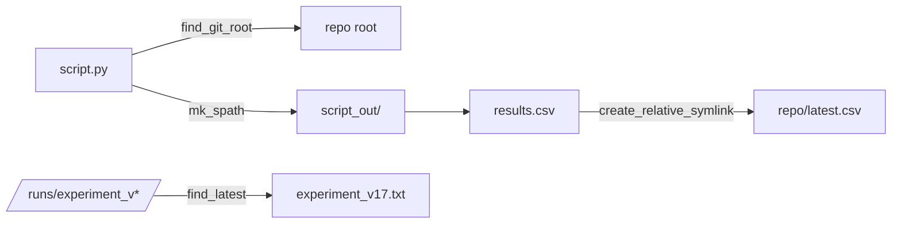

# scitex-path

<p align="center">
  <a href="https://scitex.ai">
    
  </a>
</p>

<p align="center"><b>Scientific project path utilities — find files / git root, symlink mgmt, version increment.</b></p>

<p align="center">
  <a href="https://scitex-path.readthedocs.io/">Full Documentation</a> · <code>uv pip install scitex-path[all]</code>
</p>

<!-- scitex-badges:start -->
<p align="center">
  <a href="https://pypi.org/project/scitex-path/"></a>
  <a href="https://pypi.org/project/scitex-path/"></a>
  <a href="https://github.com/ywatanabe1989/scitex-path/actions/workflows/rtd-sphinx-build-on-ubuntu-latest.yml"></a>
</p>
<p align="center">
  <a href="https://github.com/ywatanabe1989/scitex-path/actions/workflows/pytest-matrix-on-ubuntu-py3-11-3-12-3-13.yml"></a>
  <a href="https://github.com/ywatanabe1989/scitex-path/actions/workflows/import-smoke-on-ubuntu-py3-12.yml"></a>
  <a href="https://codecov.io/gh/ywatanabe1989/scitex-path"></a>
</p>
<!-- scitex-badges:end -->

---

## Problem and Solution

| # | Problem | Solution |
|---|---------|----------|
| 1 | **Scripts hard-code `/home/user/proj/...` paths** — break the moment someone else runs them | **`find_git_root()` + `get_spath(filename)`** — paths auto-resolve to the repo root and the current script's `_out/` dir |
| 2 | **`{script}_out/` convention implemented 33 different ways** — inconsistent, error-prone | **Canonical helpers** — `mk_spath`, `get_this_path`, `create_relative_symlink`, `find_latest` standardize the pattern |

## Installation

```bash
pip install scitex-path
```

## Quick Start

```python
import scitex_path as sp

git_root = sp.find_git_root()
matches = sp.find_file("/data/project", "*.csv")
```

## 1 Interfaces

<details open>
<summary><strong>Python API</strong></summary>

<br>

```python
import scitex_path as sp

# Find
sp.find_file("/data/project", "*.csv")
sp.find_dir("/runs", "results_*")
sp.find_git_root()

# Path manipulation
sp.split("/home/user/project/data/results.csv")
sp.clean("path/with/../spaces ")
sp.getsize("/path/to/dir")

# Symlinks
sp.symlink("/data/raw", "/project/data/raw")
sp.create_relative_symlink(src, dst)
sp.list_symlinks("/project/data")
sp.fix_broken_symlinks("/project/data")
sp.resolve_symlinks(path)

# Versioning
sp.increment_version("/runs", "experiment", ".txt")  # → /runs/experiment_v001.txt
sp.find_latest("/runs", "experiment", ".txt")        # → /runs/experiment_v003.txt

# Session paths (relative to calling script)
sp.this_path() / sp.get_this_path()
sp.get_spath(filename) / sp.mk_spath(filename)
```

</details>

## Architecture

```
scitex_path/
├── _clean.py              ← clean
├── _find.py               ← find_file, find_dir, find_git_root
├── _get_module_path.py    ← get_data_path_from_a_package
├── _getsize.py            ← getsize
├── _mk_spath.py           ← mk_spath
├── _split.py              ← split
├── _symlink.py            ← symlink, create_relative_symlink,
│                            list_symlinks, fix_broken_symlinks,
│                            resolve_symlinks, is_symlink, readlink,
│                            unlink_symlink
├── _this_path.py          ← this_path, get_this_path
└── _version.py            ← find_latest, increment_version
```

## Demo



```python
import scitex_path as sp

root = sp.find_git_root()                                # → /home/me/proj/myrepo
out  = sp.mk_spath("results.csv")                        # → <script>_out/results.csv
sp.create_relative_symlink(out, root / "latest.csv")
print(sp.find_latest("/runs", "experiment", ".txt"))     # → /runs/experiment_v17.txt
```

```
/home/me/proj/myrepo
/home/me/proj/myrepo/scripts/train_out/results.csv
/runs/experiment_v17.txt
```

## Part of SciTeX

`scitex-path` is part of [**SciTeX**](https://scitex.ai). Install via
the umbrella with `pip install scitex[path]` to use as
`scitex.path` (Python) or `scitex path ...` (CLI).

>Four Freedoms for Research
>
>0. The freedom to **run** your research anywhere — your machine, your terms.
>1. The freedom to **study** how every step works — from raw data to final manuscript.
>2. The freedom to **redistribute** your workflows, not just your papers.
>3. The freedom to **modify** any module and share improvements with the community.
>
>AGPL-3.0 — because we believe research infrastructure deserves the same freedoms as the software it runs on.

## License

AGPL-3.0 — see [LICENSE](LICENSE) for details.

---

<p align="center">
  <a href="https://scitex.ai" target="_blank"></a>
</p>
